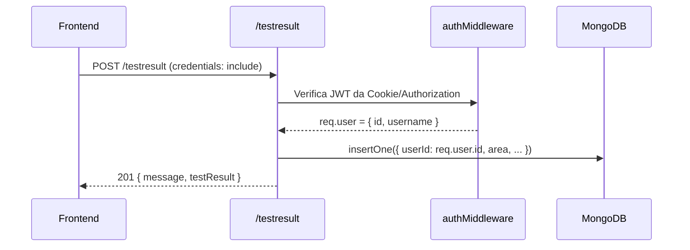
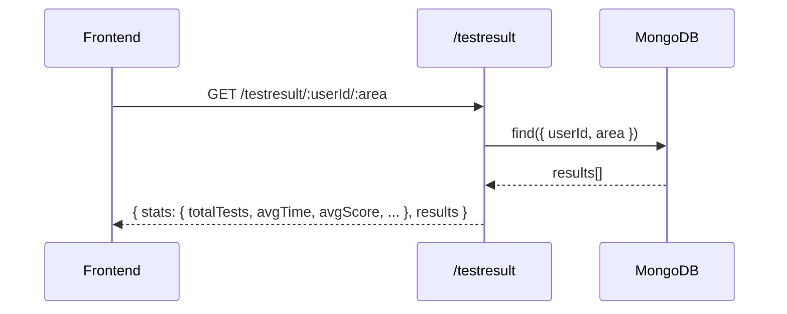
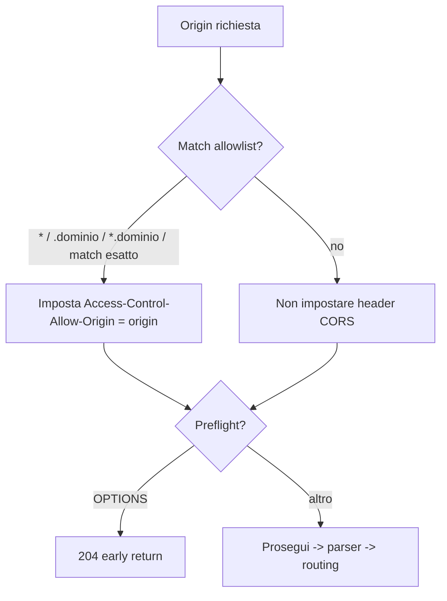

## SmartDeck – Documentazione Backend


## Panoramica architetturale

- Piattaforma: Node.js + Express
- Database: MongoDB (via Mongoose)
- Autenticazione: JWT firmato, conservato in cookie HttpOnly
- CORS: gestione personalizzata con allowlist dinamica tramite env `ALLOW_ORIGINS`
- Distribuzione (Render): `render.yaml` definisce uno “web service” per il backend e uno “static site” per il frontend con variabili d’ambiente collegate

Struttura cartelle backend:

- `index.js`: bootstrap del server, CORS, parsing JSON, health check, montaggio delle rotte e connessione a MongoDB con retry/backoff
- `db.js`: funzione di connessione Mongoose (usa `MONGODB_URI`)
- `routes/`: definizione di endpoint Express per domini funzionali
	- `auth.js`: login, registrazione, session check, logout
	- `flash.js`: elenco/creazione flashcard, elenchi per area tematica
	- `testResult.js`: salvataggio risultati test e statistiche
- `controllers/`: logica applicativa invocata dalle rotte
	- `auth.js`, `flash.js`, `testResult.js`
- `models/`: schemi Mongoose e mapping collezioni
	- `user.js`, `singleFlash.js` (flashcard), `testResult.js`

---

## Bootstrap e server

File: `backend/index.js`

Responsabilità principali:

1) CORS dinamico
- Origini consentite lette da `ALLOW_ORIGINS` (lista separata da virgola). Pattern supportati:
	- `*` (qualsiasi)
	- `*.dominio.tld` (qualsiasi sottodominio)
	- `.dominio.tld` (suffisso)
	- corrispondenza esatta dell’origin
- Per richieste consentite imposta:
	- `Access-Control-Allow-Origin` riflettendo l’origin
	- `Access-Control-Allow-Credentials: true`
	- Metodi: GET, POST, PUT, DELETE, OPTIONS
	- Headers: Content-Type, Authorization
- Le preflight OPTIONS vengono concluse con 204.

2) Parsers e rotte
- `app.use(express.json())` per il body JSON
- Monta `/auth`, poi (dopo connessione DB) `/flash` e `/testresult`

3) Connessione MongoDB con retry/backoff
- Funzione `startServer()` effettua fino a `DB_CONNECT_ATTEMPTS` (default 6) tentativi
- Backoff esponenziale (1s, 2s, 4s, … fino a 30s max)
- Se tutti i tentativi falliscono, il processo termina (exit 1)

4) Endpoints di servizio
- `GET /` risponde con stringa di “backend attivo”
- `GET /health` risponde con `{ status: 'ok'|'degraded', mongoState, uptime }`

File: `backend/db.js`
- Usa `MONGODB_URI` (env obbligatoria) per connettersi via `mongoose.connect()`
- Propaga l’errore al chiamante (gestito in `index.js`)

Variabili d’ambiente rilevanti:
- `MONGODB_URI`: stringa di connessione a MongoDB (obbligatoria)
- `PORT`: porta del server (default 3000)
- `ALLOW_ORIGINS`: CSV di origini consentite per CORS
- `JWT_SECRET`: chiave firma JWT
- `NODE_ENV`: gestisce attributi cookie (vedi Autenticazione)
- `DB_CONNECT_ATTEMPTS`: numero tentativi connessione DB (default 6)

---

## Autenticazione e sessione

File: `backend/controllers/auth.js`

Meccanica:
- Alla registrazione/login viene generato un JWT con payload `{ id, username }` e scadenza 2h
- Il token viene impostato in un cookie HttpOnly chiamato `token`
	- In sviluppo: `SameSite=Lax`
	- In produzione: `SameSite=None; Secure` per consentire cookie cross-site su HTTPS
- Il middleware legge il token da:
	- Header `Authorization: Bearer <token>` (prioritario)
	- Cookie `token` (fallback)
- Endpoint `GET /auth/me` verifica il token e risponde con `{ authenticated: boolean, user: { id, username }|null }`
- Logout invalida il cookie impostandolo con `Max-Age=0` e attributi coerenti con l’ambiente

Endpoint:
- `POST /auth/register`
	- Body: `{ username, password }`
	- Risposte: 201 con `{ message, userId, token }` e cookie impostato; 409 se username esistente
- `POST /auth/login`
	- Body: `{ username, password }`
	- Risposte: 200 con `{ token }` e cookie impostato; 401 se credenziali non valide
- `GET /auth/me`
	- Lettura JWT da header o cookie
	- Risposta: `{ authenticated, user }`
- `POST /auth/logout`
	- Cancella cookie sessione

Sicurezza:
- Cookie HttpOnly impedisce accesso via JavaScript (mitiga XSS sul token)
- In produzione serve HTTPS per `Secure` e `SameSite=None`
- Le chiamate dal frontend devono usare `credentials: 'include'`

---

## Modelli dati (Mongoose)

1) Utente – `backend/models/user.js`
```js
username: String (unique, required)
password: String (hash Bcrypt)
collezione: 'user'
```

2) Flashcard – `backend/models/singleFlash.js`
```js
question: String (required)
answers: [ { text: String, isCorrect: Boolean } ] (esattamente 3 elementi)
thematicArea: String (required)
difficulty: 'facile'|'media'|'difficile' (required)
collezione: 'datasmartdeckCollection'
```

3) Risultato test – `backend/models/testResult.js`
```js
userId: ObjectId(User) (required)
area: String (required)
numQuestions: Number (required)
answers: [ { question, userAnswer, correctAnswer, isCorrect, time } ]
correctCount: Number (required)
totalTime: Number (required) // ms
createdAt: Date (default Now)
collezione: 'testResults'
indici: (userId, area, createdAt), (area, createdAt)
```

Note:
- `answers.time` è il tempo impiegato per ciascuna domanda (ms)
- `totalTime` è somma dei tempi per il test (ms)

---

## Rotte e controller

### Autenticazione – `routes/auth.js` → `controllers/auth.js`
Già descritte nella sezione Autenticazione.

### Flashcard – `routes/flash.js` → `controllers/flash.js`

Endpoint principali:
- `GET /flash`
	- Restituisce tutte le flashcard
	- Esempio risposta: `[{ _id, question, answers:[{text,isCorrect}], thematicArea, difficulty }]`

- `GET /flash/thematic/:thematicArea`
	- Restituisce flashcard filtrate per area tematica
	- Parametri: `thematicArea` (string)

- `POST /flash`
	- Creazione bulk di flashcard
	- Due forme di payload supportate:
		1) Array di documenti flashcard completi
		2) Oggetto `{ thematicArea, questions: [{ question, answers, difficulty? }] }`
			 - In questo caso la difficulty dei singoli item defaulta a `media` se non fornita
	- Risposta: `{ createdCount, created: [...] }`

- `GET /flash/areas/list`
	- Restituisce `{ areas: [ ... ] }` con tutte le aree tematiche distinte

Validazioni importanti:
- Ogni flashcard deve avere esattamente 3 risposte (`validate` sullo schema)

### Risultati test e statistiche – `routes/testResult.js` → `controllers/testResult.js`

Sicurezza:
- `POST /testresult` è protetto da `authMiddleware`: l’utente deve essere autenticato
- Il controller deriva `userId` da `req.user.id` (token JWT) ignorando input non affidabili

Endpoint:
- `POST /testresult`
	- Body: `{ area, numQuestions, answers:[{question,userAnswer,correctAnswer,isCorrect,time}], correctCount, totalTime }`
	- Richiede cookie di sessione valido (o header Authorization)
	- Salva il documento su collezione `testResults`
	- Risposte: 201 `{ message, testResult }`, 401 se non autenticato

- `GET /testresult/areas/list?userId=...`
	- Query opzionale `userId` per filtrare le aree in cui l’utente ha test
	- Risposta `{ areas: [ ... ] }`

- `GET /testresult/:userId/:area`
	- Statistiche per utente e area
	- Risposta:
		```json
		{
			"stats": {
				"totalTests": n,
				"totalQuestions": n,
				"totalCorrect": n,
				"totalTime": ms,
				"avgTime": msPerDomanda,
				"avgScore": corrette/total
			},
			"results": [ ... ]
		}
		```

- `GET /testresult/aggregate/:area`
	- Statistiche aggregate sull’area (tutti gli utenti)
	- Includono distribuzione percentuale dei punteggi in bin da 20%

- `GET /testresult/recent/:area?limit=20`
	- Ultimi risultati per area, ordinati per `createdAt` decrescente

- `GET /testresult/wrong/:userId/:area?limit=50`
	- Restituisce una lista “flattened” delle ultime risposte errate dell’utente in quell’area
	- Risposta `{ wrong: [ { question, userAnswer, correctAnswer, createdAt } ] }`

Performance:
- Gli indici su `testResults` rendono efficienti le query per utente/area e per recenti

---

## Flussi principali (end-to-end)

1) Login/Registrazione
- Il FE invia le credenziali a `/auth/login` o `/auth/register`
- Il BE valida, genera JWT e imposta cookie HttpOnly
- Il FE usa `credentials: 'include'` nelle fetch successive

2) Avvio test
- Il FE chiede le flashcard all’endpoint `/flash/thematic/:thematicArea`
- Il FE mescola/seleziona un sottoinsieme e traccia i tempi per domanda

3) Salvataggio risultato
- Al termine, il FE invia `POST /testresult` con conteggio corrette, answers e `totalTime`
- Il BE associa il `userId` dal JWT e salva su `testResults`

4) Statistiche utente
- Il FE interroga `/testresult/areas/list?userId=...` per ottenere le aree su cui l’utente ha risultati
- Per una singola area usa `/testresult/:userId/:area` e, opzionalmente, `/testresult/wrong/:userId/:area` per il pannello errori

---

## Diagrammi di flusso (Backend)

### Pipeline richiesta → risposta (alto livello)

```mermaid
flowchart LR
	A[Richiesta HTTP] --> B{CORS allowlist}
	B -- consentita --> C[Imposta header CORS\nreflect origin + credentials]
	B -- negata --> D[No header CORS]
	C --> E[express.json()]
	D --> E
	E --> F{Routing}
	F -->|/auth| G[controllers/auth]
	F -->|/flash| H[controllers/flash]
	F -->|/testresult| I[controllers/testResult]
	G --> J[(MongoDB via Mongoose)]
	H --> J
	I --> J
	J --> K[Risposta JSON]
```

### Login / Registrazione (JWT nel cookie)

```mermaid
sequenceDiagram
	participant FE as Frontend
	participant API as /auth
	participant DB as MongoDB

	FE->>API: POST /auth/register { username, password }
	API->>DB: findOne(username) / insertOne(hash)
	API-->>FE: Set-Cookie: token=JWT(...); HttpOnly; SameSite=(Lax|None); Secure?

	FE->>API: POST /auth/login { username, password }
	API->>DB: findOne(username) + bcrypt.compare
	API-->>FE: Set-Cookie: token=JWT(...)
```

### Salvataggio risultato test (protetto)



### Statistiche utente per area



### Decisione CORS (allowlist)



---

## Note su ambienti e CORS

- In sviluppo spesso FE e BE girano su host/porte diverse (es. localhost:3000 e localhost:3001):
	- CORS deve riflettere l’origin del FE e consentire credenziali
	- I cookie sono `SameSite=Lax` in dev
- In produzione (es. Render):
	- FE è uno static site, BE un web service; le URL si popolano in `render.yaml`
	- `ALLOW_ORIGINS` viene impostato automaticamente al dominio del FE
	- Cookie con `SameSite=None; Secure` richiede HTTPS e viene gestito da Render

---

## Esempi di richieste

Registrazione:
```
POST /auth/register
{
	"username": "alice",
	"password": "pwd123"
}
```

Login:
```
POST /auth/login
{
	"username": "alice",
	"password": "pwd123"
}
```

Lista aree tematiche:
```
GET /flash/areas/list
-> { "areas": ["AWS", "Salesforce", ...] }
```

Flashcard per area:
```
GET /flash/thematic/AWS
-> [ { question, answers:[{text,isCorrect}], thematicArea:"AWS", difficulty:"media" }, ... ]
```

Salvataggio risultato test (autenticato):
```
POST /testresult
{
	"area": "AWS",
	"numQuestions": 10,
	"answers": [
		{ "question": "...", "userAnswer": "A", "correctAnswer": "B", "isCorrect": false, "time": 3100 },
		...
	],
	"correctCount": 7,
	"totalTime": 52340
}
```

Statistiche utente per area:
```
GET /testresult/<userId>/AWS
```

Ultime risposte sbagliate:
```
GET /testresult/wrong/<userId>/AWS?limit=50
```

---

## Linee guida di estensione

- Aggiungere nuove proprietà al modello Flashcard:
	- Estendere `flashcardSchema` in `singleFlash.js` e, se esposto, aggiornare il controller
- Nuove statistiche:
	- Implementare in `controllers/testResult.js`, aggiungere rotta in `routes/testResult.js`
	- Valutare indici aggiuntivi se le query diventano pesanti
- Nuove policy di sicurezza:
	- Aggiornare il set di header CORS in `index.js`
	- Adeguare i cookie in `controllers/auth.js`

---

## Troubleshooting

- Cookie non inviato dal FE:
	- Verificare che le fetch abbiano `credentials: 'include'`
	- In produzione richiede HTTPS e `SameSite=None` (già gestito)

- 401 su `POST /testresult` pur essendo loggati:
	- Controllare `/auth/me`: se `authenticated: false`, il cookie non è presente/valido
	- Controllare CORS/ALLOW_ORIGINS

- `MONGODB_URI is not set`:
	- Impostare la variabile nel servizio backend (Render o locale)

- Health check fallisce su Render:
	- Verificare `GET /health` e lo stato `mongoState`

---

## Dipendenze (estratto package.json)

- express 5
- mongoose 8
- jsonwebtoken 9
- bcrypt 6
- dotenv 17

Versioni moderne con default sicuri (es. Mongoose v6+).

---

## Deployment (Render)

File: `render.yaml`
- Servizio web backend:
	- build: `cd backend && npm install`
	- start: `cd backend && node index.js`
	- health check su `/health`
	- `MONGODB_URI` collegato a database Render
	- `JWT_SECRET` autogenerato
	- `ALLOW_ORIGINS` puntato all’URL del frontend
- Static site frontend:
	- build: `cd frontend && npm install && npm run build`
	- pubblicazione in `frontend/build`
	- `REACT_APP_API_HOST` puntato all’URL del backend

---

Questa documentazione riflette il codice corrente del backend ed è pensata come riferimento operativo per sviluppatori e manutentori del progetto.
