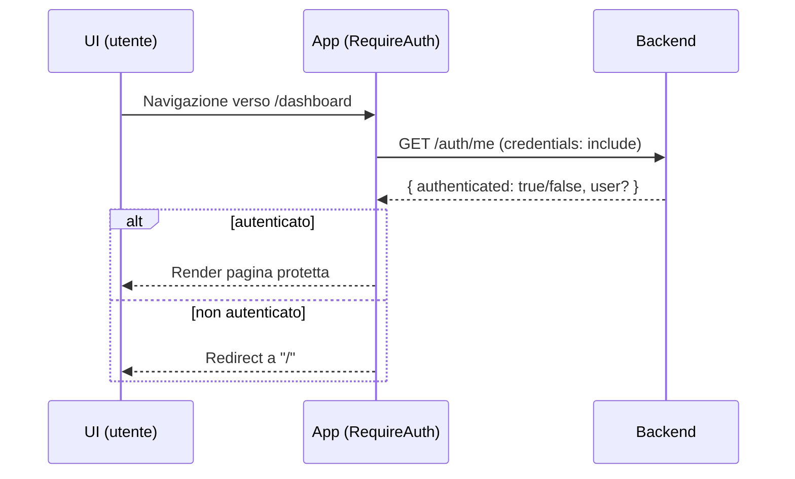
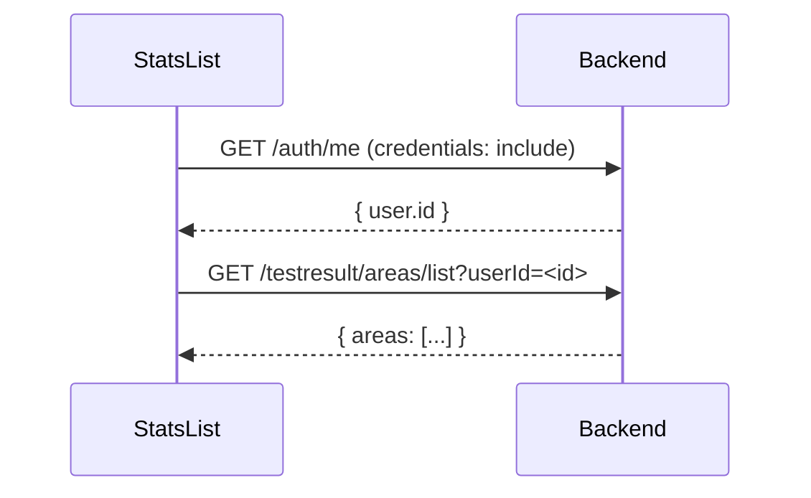
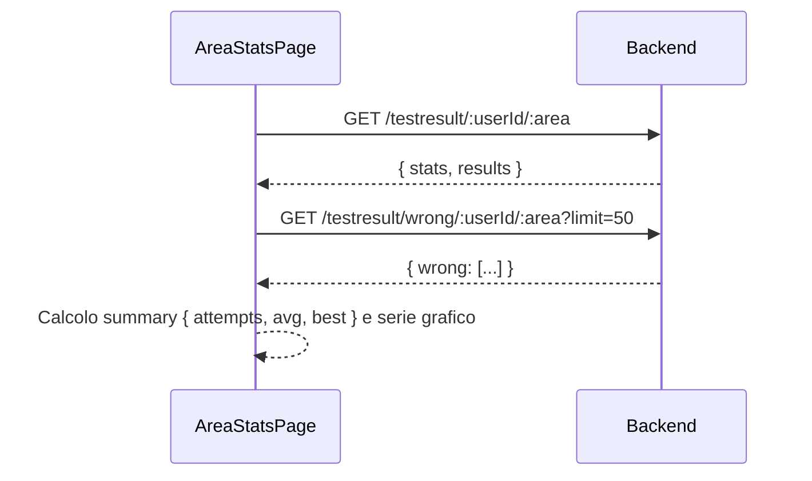

## Documentazione Tecnica Frontend (SmartDeck)

Questo documento descrive in dettaglio l’architettura del frontend, ogni pagina e ogni componente, i flussi dati con il backend, le scelte di stile e le considerazioni tecniche. È pensato come documentazione tecnica per revisione accademica.

### Stack e convenzioni

- Libreria: React (CRA)
- Routing: `react-router-dom` con `HashRouter`
- Chiamate HTTP: `fetch` con `credentials: 'include'` per inviare i cookie httpOnly
- Gestione config host API: `src/utils/apiHost.js`
- Stili: CSS modularizzato per pagina/componente (cartella `src/css/`); classi comuni: `modern-input`, `modern-btn`, “chip”, “card”
- Chart: `recharts` (LineChart) incapsulato in `AreaChart`

### Autenticazione lato FE (panoramica)

- Cookie httpOnly JWT impostato dal backend in `POST /auth/login` e `POST /auth/register`.
- Verifica sessione con `GET /auth/me` (risponde `{ authenticated: boolean, user?: { id, username } }`).
- Logout con `POST /auth/logout` (invalida cookie).
- Tutte le `fetch` che richiedono autenticazione usano `credentials: 'include'`.

---

## Struttura e routing

File: `src/App.jsx`

- Router: `HashRouter` per compatibilità hosting statico.
- Rotte:
	- `/` → `LandingPage`
	- `/login` → redirect a `/`
	- Protette da `RequireAuth` (vedi sotto):
		- `/dashboard` → `DashboardPage`
		- `/stats` → `StatsList`
		- `/stats/:area` → `AreaStatsPage`
		- `/crea-test` → `CreateTestPage`
		- `/pretest/:area` → `PreTestPage`
		- `/test/:area/:num` → `TestPage`

### RequireAuth

- Componente inline in `App.jsx`.
- Contratto:
	- Input: `children` (JSX)
	- Processo: chiama `GET /auth/me` con `credentials: 'include'`.
	- Output: se autenticato → render, altrimenti navigate a `/`.
- Edge cases:
	- UI mostra null durante `loading` (evita flash di redirect).

---

## Configurazione host API

- Logica:
	- In dev su `localhost`, fallback a `http://localhost:3000`.
	- In altri ambienti, vuoto (stesso origin del backend se reverse-proxy/prod).

---

## Pagine

### LandingPage

File: `src/pages/LandingPage.jsx` — Stili: `src/css/LandingPage.css`

- Scopo: login/registrazione tramite form unico con toggle.
- Stato locale:
	- `mode`: `'login' | 'register'`
	- `username`, `password`, `loading`, `error`
- Eventi:
	- `toggleMode`: switch tra login e registrazione.
	- `handleSubmit`: POST a `/auth/${mode}` con JSON `{ username, password }`, `credentials: 'include'`.
- Esito:
	- Se ok: redirect `/#/dashboard`.
	- Se errore: visualizza `error`.
- Accessibilità: label placeholder, `autoComplete` on, focus chiaro sul campo (`modern-input:focus`).
- UI: card centrale con sfondo “metallico”, input moderni, CTA gialla, link toggle stile testo.

### DashboardPage

File: `src/pages/DashboardPage.jsx` — Stili: `src/css/DashboardPage.css`

- Scopo: elenca aree tematiche con immagine di copertina e bottone “play”.
- Dati:
	- `GET /flash/areas/list` (con `credentials: 'include'`).
	- Mappatura: per ogni area, immagine concettuale da Unsplash Source; fallback a gradiente inline SVG (data URI) per affidabilità.
- Comportamento UI:
	- `useLayoutEffect`: ridimensiona il titolo `.area-title` per evitare overflow (misura `scrollWidth` vs `clientWidth`, decrementa font finché rientra).
	- `Play`: navigate a `/pretest/:area`.
- Edge cases: caricamento, nessuna area → messaggio placeholder.

### PreTestPage

File: `src/pages/PreTestPage.jsx` — Stili: `src/css/PreTestPage.css`

- Scopo: configurare il test (numero domande) prima di iniziare.
- Dati:
	- `GET /flash/thematic/:area` per calcolare `maxQuestions`.
- Stato e UI:
	- `numQuestions` con quick-picks (chip 5/10/15/20 filtrati ≤ `maxQuestions`).
	- Input numerico con clamp [1..max].
	- CTA “Inizia il test” → navigate a `/test/:area/:numQuestions`.

### TestPage

File: `src/pages/TestPage.jsx` — Stili: `src/css/TestPage.css`

- Scopo: eseguire il test, tracciare tempi/risposte, salvare il risultato e mostrare un riepilogo.
- Caricamento domande:
	- Caso “custom”: legge `sessionStorage.activeCustomTest` e, se corrisponde all’area, usa quelle domande (taglia a `num`).
	- Caso standard: `GET /flash/thematic/:area`, shuffle e slice(`num`).
- Tracciamento tempi:
	- `timerRef.current = Date.now()` all’inizio e ad ogni avanzamento.
	- `handleAnswer(i)`: salva tempo trascorso prima di avanzare alla prossima domanda.
	- Bug fix last question: cattura l’elapsed PRIMA di resettare; per l’ultima domanda usa tali valori per evitare “0.00s”.
- Salvataggio risultato:
	- Costruisce `answersData`: `{ question, userAnswer, correctAnswer, isCorrect, time }` per ciascuna.
	- `correctCount`, `totalTime` (somma tempi in ms).
	- Payload: `{ userId?, area, numQuestions, answers, correctCount, totalTime, createdAt }`.
	- `POST /testresult` con `credentials: 'include'` (auth via cookie); backend associa `userId` da sessione JWT se presente.
- UI risultati:
	- Stat box: totali, tempo medio, percentuale.
	- Panel “domande sbagliate” con coppia risposta data/corretta.
	- Pulsante “Vai alla sezione test” → torna a `/dashboard` e scrolla a `#tests`.

### StatsList

File: `src/pages/StatsList.jsx` — Stili: `src/css/StatsPage.css`

- Scopo: elenco aree per cui esistono risultati utente.
- Dati:
	- `GET /auth/me` → ottiene `user.id`.
	- `GET /testresult/areas/list?userId=<id>` → array aree.
- UI: header con titolo/sottotitolo; griglia di chip navigabili a `/stats/:area`.
- Edge: loading/empty states espliciti.

### AreaStatsPage

File: `src/pages/AreaStatsPage.jsx` — Stili: `src/css/StatsPage.css`

- Scopo: statistiche aggregate dell’utente per area + errori recenti.
- Dati:
	- `GET /auth/me` → `user.id`.
	- `GET /testresult/:userId/:area` → `{ stats, results }` con:
		- `stats.totalTests, stats.avgScore, ...`
		- `results` (lista tentativi)
	- `GET /testresult/wrong/:userId/:area?limit=50` → array errori recenti (deduplicati per domanda+risposta corretta, mantenendo solo l'occorrenza più recente)
- Calcoli UI:
	- `summary`: `{ attempts, avg, best }` dove `avg = round(avgScore*100)`; `best` = max percentuale tra i risultati.
	- Serie grafico: `[{label: '#<index>', score: <percent>}, ...]` in ordine cronologico.
- Visualizzazione:
	- 3 `StatsBox` (Tentativi, Punteggio medio, Record).
	- Chart `AreaChart`.
	- Lista errori recenti (domanda, risposta data/corretta).

### CreateTestPage

File: `src/pages/CreateTestPage.jsx` — Stili: `src/css/CreateTestPage.css`

- Scopo: creare rapidamente nuove flashcards (test tematico) e inviarle al backend.
- Stato:
	- `testName` (nome area/tema), `numQuestions`, `questions[{question, answers[3]}]`, `correctIndexes` (indice corretta per domanda), `fileName` (solo display).
- UI/UX:
	- Card con header e sottotitolo guida.
	- Quick-picks (chip 5/10/15) per `numQuestions`.
	- File input custom (solo nome file mostrato; non ancora usato dal backend).
	- Ogni domanda ha 3 risposte; selettore “Corretta” come pill nera/gialla; focus-within evidenzia card.
- Submit:
	- Payload: `{ thematicArea: testName, questions: [{ question, answers: [{ text, isCorrect }], difficulty: 'media' }] }`.
	- `POST /flash` con `credentials: 'include'`.
	- Fallback offline: salva in `localStorage.customTests` e reindirizza a dashboard.

---

## Componenti

### Topbar

File: `src/components/Topbar.jsx`

- Tre pulsanti: Test (dashboard), Stats, Crea un nuovo test.
- Evidenzia il pulsante attivo in base a `location.pathname`.
- Navigazione con `useNavigate()`.

### LogoutButton

File: `src/components/LogoutButton.jsx` — Stili: `src/css/LogoutButton.css`

- Montato globalmente in `App.jsx` (visibile su tutte le pagine tranne `/` e `/login`).
- Posizionamento: fisso in basso a destra (20px da bordi).
- Click: `POST /auth/logout` (include credentials), pulizia locale minima (rimuove token da localStorage se presente per retrocompatibilità) e navigate `/`.
- UI: pulsante rosso con icona "Esci", bordo arrotondato, ombra, hover con effetto scale.

### LogoBadge

File: `src/components/LogoBadge.jsx` — Stili: `src/css/LogoBadge.css`

- Montato globalmente in `App.jsx` (visibile su tutte le pagine).
- Posizionamento: fisso in basso a sinistra (20px da bordi), opposto al pulsante logout.
- UI: contenitore 44x44px con bordo sottile, ombra leggera e sfondo bianco semi-trasparente; contiene logo 28x28px (`public/logo.png`).
- Scopo: identità visiva del sito, sempre presente.

### AreaChart (Recharts)

File: `src/components/AreaChart.jsx`

- Memoized.
- Props: `data` (array), `dataKey` (default `score`), `height` (default 220).
- Render: `ResponsiveContainer` + `LineChart` con griglia, X/Y axis, tooltip, linea `monotone`.

### StatsBox

File: `src/components/StatsBox.jsx`

- Presentational: mostra `title`, `value` e `description`.

### AreaBox

File: `src/components/AreaBox.jsx`

- Componente semplice (titolo + pulsante). Non è usato direttamente nella dashboard attuale (che rende una card con immagine e bottone play custom), ma può fungere da fallback o esempio minimal.

 

## Stili e scelte UI

- Palette: giallo (CTA/accenti) + nero/grigio scuro per contrasti; sfondi metallici soft nelle landing/pagine.
- Classi comuni:
	- `modern-input`: input con bordi arrotondati, focus visibile (giallo), transizione hover/focus.
	- `modern-btn`: CTA con gradiente giallo, border/ombra scuri leggeri.
	- `chip`, `chip-gold`: bottoni pill per quick-pick.
	- Card: bordi e ombre soft, spesso con accento giallo.
- Background immagini: `sfondo_pages.jpg` come decorazione; contenute in wrapper con `position: fixed` per restare dietro al contenuto (z-index 0) e non intralciare lo scroll/gesture.
- Responsività: griglie e card con media queries nelle rispettive CSS.

---

## Flussi dati e contratti con il backend

### Autenticazione

- Login/Registrazione: `POST /auth/login | /auth/register`
	- Body: `{ username: string, password: string }`
	- Effetto: cookie httpOnly `token` impostato dal server (lato FE non visibile via JS).
- Stato sessione: `GET /auth/me`
	- Risposta: `{ authenticated: boolean, user?: { id: string, username: string } }`
- Logout: `POST /auth/logout`
	- Effetto: cookie invalidato (Max-Age=0) dal server.

### Flashcards

- Lista aree: `GET /flash/areas/list`
	- Risposta: `{ areas: string[] }`
- Flashcards per area: `GET /flash/thematic/:area`
	- Risposta: `Array<{ question: string, answers: Array<{ text: string, isCorrect: boolean }> }>`
- Creazione test (flashcards): `POST /flash`
	- Body: `{ thematicArea: string, questions: Array<{ question: string, answers: Array<{ text: string, isCorrect: boolean }>, difficulty: string }>} }

### Risultati test

- Salvataggio: `POST /testresult`
	- Body: `{ userId?: string, area: string, numQuestions: number, answers: Array<{ question, userAnswer, correctAnswer, isCorrect, time }>, correctCount: number, totalTime: number, createdAt: string }`
	- Note: `userId` può essere omesso; il backend preferisce quello in sessione dal cookie.
- Aree con risultati per utente: `GET /testresult/areas/list?userId=<id>` → `{ areas: string[] }`
- Statistiche utente per area: `GET /testresult/:userId/:area` → `{ stats, results }`
- Errori recenti utente per area: `GET /testresult/wrong/:userId/:area?limit=<n>` → `{ wrong: Array<{ question, userAnswer, correctAnswer, createdAt }> }`

---

## Considerazioni tecniche e performance

- Credenziali/CORS: tutte le `fetch` che riguardano dati utente includono `credentials: 'include'`; il backend riflette l’`Origin` ammesso ed abilita i cookie cross-site in produzione.
- Misura titoli area: uso di `useLayoutEffect`, `requestAnimationFrame` e `resize` listener per rendere i titoli leggibili senza overflow.
- Grafici: `AreaChart` memoizzato per evitare ridisegni inutili.
- Error handling: stati di caricamento (`null`), fallback su errori (liste vuote, messaggi informativi), try/catch nei flussi.
- Offline fallback: nella creazione test, se POST fallisce, salvataggio locale (`localStorage.customTests`) per non perdere lavoro.

---

## Estensioni future (idee)

- Salvataggio immagini di copertina test (attualmente solo nome file lato FE).
- Difficoltà questionario selezionabile (UI + filtro lato backend).
- Timer globale del test e penalità tempo nelle statistiche.
- Paginazione/virtualizzazione per liste domande lunghe.
- Internazionalizzazione (i18n) per testi UI.

---

## Esempi di dati

### Flashcard (singola)

```json
{
	"question": "Quanto fa 2 + 2?",
	"answers": [
		{ "text": "3", "isCorrect": false },
		{ "text": "4", "isCorrect": true },
		{ "text": "5", "isCorrect": false }
	]
}
```

### Payload salvataggio test

```json
{
	"area": "Matematica",
	"numQuestions": 10,
	"answers": [
		{
			"question": "2+2?",
			"userAnswer": "3",
			"correctAnswer": "4",
			"isCorrect": false,
			"time": 2450
		}
	],
	"correctCount": 7,
	"totalTime": 63123,
	"createdAt": "2025-10-25T11:22:33.123Z"
}
```

---

## Note operative

- Variabile d’ambiente FE: `REACT_APP_API_HOST` (opzionale) per puntare al backend; in dev locale cade su `http://localhost:3000`.
- Ricordare `credentials: 'include'` per tutte le richieste che richiedono sessione.
- Le rotte sono hash-based; i link interni usano `/#/percorso` quando si fa redirect manuale.

---

## Diagrammi di flusso (Frontend)

### Guard di autenticazione e routing protetto



### Login / Registrazione (cookie httpOnly)

```mermaid
sequenceDiagram
	participant LP as LandingPage
	participant BE as Backend

	LP->>BE: POST /auth/(login|register) { username, password }
	BE-->>LP: Set-Cookie: token=...; HttpOnly; SameSite=(Lax|None); Secure?
	LP-->>LP: Redirect a /#/dashboard
```

### Flusso test: dalla configurazione al salvataggio

```mermaid
flowchart TD
	A[Dashboard] --> B[PreTest: scegli n domande]
	B --> C{Carica flashcard\n GET /flash/thematic/:area}
	C -->|ok| D[TestPage]
	D --> E[Per ogni domanda:\n start timer -> click risposta -> salva elapsed]
	E --> F{Ultima domanda?}
	F -- No --> D
	F -- Sì --> G[Calcola risultati\n correctCount, totalTime, answers[]]
	G --> H[POST /testresult\n(credentials: include)]
	H --> I[Mostra riepilogo + errori]
	I --> J["Vai alla sezione test" -> /dashboard + scroll #tests]
```

### Statistiche utente (lista aree e dettaglio area)





